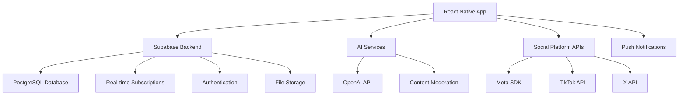

# Design Document

## Overview

Mind-digest is a React Native mobile application built with modern architecture principles to deliver a seamless mental health and wellness experience. The app combines peer support, practical anxiety tools, and multi-platform social sharing in an intuitive, secure, and scalable platform. The design prioritizes user privacy, real-time interactions, and AI-powered personalization while maintaining simplicity and accessibility.

## Architecture

### High-Level Architecture



### Technology Stack

- **Frontend:** React Native 0.81.0 with React 19.1.0
- **Backend:** Supabase (PostgreSQL, Real-time, Auth, Storage)
- **AI/ML:** OpenAI API for insights and content analysis
- **Social Integration:** Platform-specific SDKs (Meta, TikTok, X)
- **State Management:** React Query + Zustand
- **Navigation:** React Navigation 7.0
- **UI Framework:** Custom components with Expo Linear Gradient
- **Push Notifications:** Expo Notifications

## Components and Interfaces

### Core Components

#### 1. Authentication System
- **Supabase Auth Integration:** Email/password, social logins
- **Anonymous Mode:** Temporary accounts for privacy-conscious users
- **Profile Management:** Customizable privacy settings and preferences

#### 2. Peer Support Network
- **Chat Interface:** Real-time messaging with Supabase subscriptions
- **Matching Algorithm:** Interest-based and experience-based pairing
- **Moderation System:** AI-powered content filtering + human oversight
- **Safety Features:** Report/block functionality, crisis detection

#### 3. Social Ease Toolkit
- **Conversation Starters:** Categorized by situation (work, social, dating, etc.)
- **Role-Play Simulator:** Interactive scenarios with branching conversations
- **Social Scenario Planner:** Step-by-step guides for specific situations
- **Progress Tracking:** Confidence metrics and skill development analytics

#### 4. Multi-Platform Sharing Engine
- **Content Templates:** Platform-optimized formats (Stories, Posts, Videos)
- **Anonymization Layer:** Remove identifying information while preserving message
- **Export Manager:** One-tap sharing with platform-specific formatting
- **Engagement Analytics:** Track reach and impact across platforms

#### 5. AI-Powered Journaling
- **Rich Text Editor:** Support for text, voice-to-text, and mood indicators
- **Pattern Recognition:** NLP analysis for mood trends and trigger identification
- **Insight Generation:** Personalized recommendations based on journal analysis
- **Data Visualization:** Interactive charts and progress tracking

#### 6. Mindfulness & Breathing Exercises
- **Audio Player:** Guided meditation and breathing exercise playback
- **Visual Breathing Guide:** Animated breathing patterns with customizable timing
- **Biometric Integration:** Heart rate monitoring via phone sensors
- **Session Tracking:** Duration, frequency, and effectiveness metrics

### Interface Design Principles

#### User Experience
- **Minimalist Design:** Clean, calming interface with soft colors and gentle animations
- **Accessibility First:** Screen reader support, high contrast options, large touch targets
- **Progressive Disclosure:** Show complexity gradually based on user comfort level
- **Emotional Design:** Use color psychology and micro-interactions to promote calm

#### Navigation Structure
```
Tab Navigation:
├── Home (Dashboard)
├── Connect (Peer Support)
├── Toolkit (Social Ease Tools)
├── Journal (AI Journaling)
└── Profile (Settings & Progress)

Modal Overlays:
├── Emergency Support
├── Breathing Exercises
├── Social Sharing
└── Crisis Resources
```

## Data Models

### User Profile
```typescript
interface UserProfile {
  id: string;
  email?: string;
  isAnonymous: boolean;
  displayName: string;
  avatar?: string;
  preferences: {
    interests: string[];
    privacyLevel: 'public' | 'friends' | 'private';
    notificationSettings: NotificationPreferences;
  };
  mentalHealthProfile: {
    conditions?: string[];
    triggers?: string[];
    goals: string[];
  };
  createdAt: Date;
  lastActive: Date;
}
```

### Chat & Peer Support
```typescript
interface ChatRoom {
  id: string;
  name: string;
  description: string;
  category: 'anxiety' | 'depression' | 'general' | 'crisis';
  isModerated: boolean;
  participants: string[];
  createdAt: Date;
}

interface Message {
  id: string;
  roomId: string;
  senderId: string;
  content: string;
  type: 'text' | 'image' | 'audio';
  isModerated: boolean;
  timestamp: Date;
}
```

### Journal & Mood Tracking
```typescript
interface JournalEntry {
  id: string;
  userId: string;
  content: string;
  mood: number; // 1-10 scale
  emotions: string[];
  triggers?: string[];
  aiInsights?: {
    sentiment: number;
    keyThemes: string[];
    recommendations: string[];
  };
  createdAt: Date;
}

interface MoodEntry {
  id: string;
  userId: string;
  mood: number;
  energy: number;
  anxiety: number;
  notes?: string;
  timestamp: Date;
}
```

### Social Sharing
```typescript
interface ShareableContent {
  id: string;
  userId: string;
  type: 'mood_update' | 'achievement' | 'tip' | 'quote';
  content: string;
  platforms: ('instagram' | 'tiktok' | 'x' | 'facebook')[];
  isAnonymous: boolean;
  engagement: {
    views: number;
    likes: number;
    shares: number;
  };
  createdAt: Date;
}
```

## Error Handling

### Client-Side Error Handling
- **Network Errors:** Offline mode with local storage and sync when reconnected
- **Authentication Errors:** Graceful fallback to anonymous mode
- **Validation Errors:** Real-time form validation with helpful error messages
- **Crash Recovery:** Error boundaries with user-friendly recovery options

### Server-Side Error Handling
- **Database Errors:** Automatic retry with exponential backoff
- **AI Service Failures:** Fallback to rule-based responses
- **Rate Limiting:** Queue management for API calls
- **Data Consistency:** Transaction management for critical operations

### Crisis Situation Handling
- **Immediate Response:** Direct connection to crisis hotlines
- **Escalation Protocols:** Automatic alerts for severe risk indicators
- **Backup Systems:** Multiple redundant pathways for emergency support
- **Legal Compliance:** Proper handling of mandatory reporting situations

## Testing Strategy

### Unit Testing
- **Component Testing:** React Native Testing Library for UI components
- **Logic Testing:** Jest for business logic and utility functions
- **API Testing:** Mock Supabase responses for consistent testing
- **AI Integration Testing:** Mock OpenAI responses with various scenarios

### Integration Testing
- **End-to-End Testing:** Detox for full user journey testing
- **Real-time Features:** WebSocket connection testing
- **Social Platform Integration:** Mock API responses for sharing features
- **Database Integration:** Test data consistency and performance

### User Acceptance Testing
- **Accessibility Testing:** Screen reader and keyboard navigation testing
- **Performance Testing:** Load testing for chat and real-time features
- **Security Testing:** Authentication and data privacy validation
- **Crisis Response Testing:** Verify emergency features work under stress

### Mental Health Specific Testing
- **Content Moderation:** Test AI filtering with various content types
- **Crisis Detection:** Validate trigger word detection and response
- **Privacy Protection:** Ensure anonymization works correctly
- **Therapeutic Efficacy:** A/B testing for intervention effectiveness

## Security and Privacy Considerations

### Data Protection
- **Encryption:** End-to-end encryption for sensitive communications
- **Anonymization:** Robust user identity protection for public sharing
- **Data Minimization:** Collect only necessary information
- **Right to Deletion:** Complete data removal on user request

### Compliance
- **HIPAA Considerations:** Health data handling best practices
- **GDPR Compliance:** European privacy regulation adherence
- **Platform Policies:** Compliance with app store and social platform requirements
- **Crisis Response:** Legal obligations for mandatory reporting

### Content Safety
- **AI Moderation:** Real-time content filtering for harmful material
- **Human Oversight:** Escalation to human moderators for complex cases
- **Community Guidelines:** Clear rules and enforcement mechanisms
- **Crisis Intervention:** Automatic detection and response protocols

## Performance Optimization

### Mobile Performance
- **Lazy Loading:** Load components and data on demand
- **Image Optimization:** Compressed images with progressive loading
- **Caching Strategy:** Intelligent caching for offline functionality
- **Bundle Optimization:** Code splitting and tree shaking

### Real-time Performance
- **Connection Management:** Efficient WebSocket connection handling
- **Message Queuing:** Reliable message delivery with retry logic
- **Presence Indicators:** Efficient user status tracking
- **Scalability:** Horizontal scaling for growing user base

### AI Performance
- **Response Caching:** Cache common AI responses to reduce latency
- **Batch Processing:** Group AI requests for efficiency
- **Fallback Systems:** Quick responses when AI services are slow
- **Cost Optimization:** Intelligent usage of AI services to manage costs